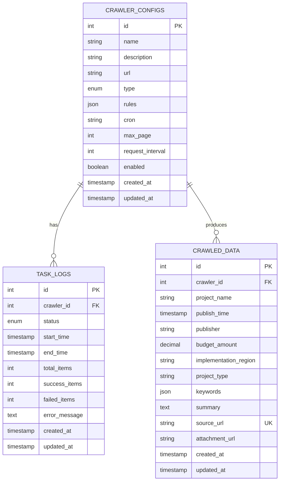

# 数据库ER图

## 实体关系图

## 关系说明

1. **一对多关系**: 
   - 一个爬虫配置可以有多条任务日志记录
   - 一个爬虫配置可以爬取多条数据记录

2. **外键约束**:
   - `task_logs.crawler_id` → `crawler_configs.id`
   - `crawled_data.crawler_id` → `crawler_configs.id`

3. **唯一约束**:
   - `crawled_data.source_url` 确保数据去重